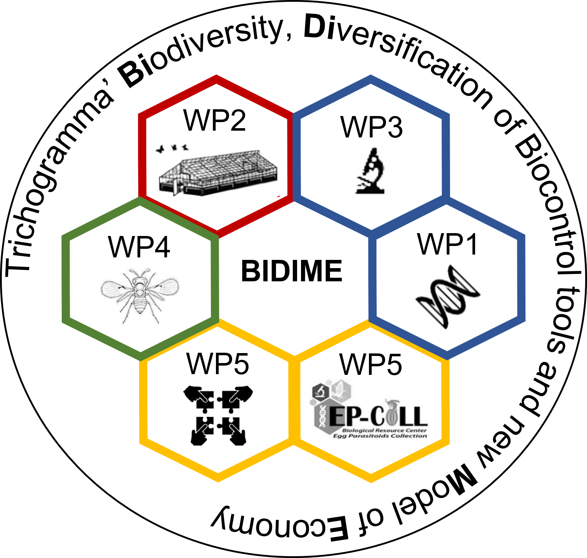
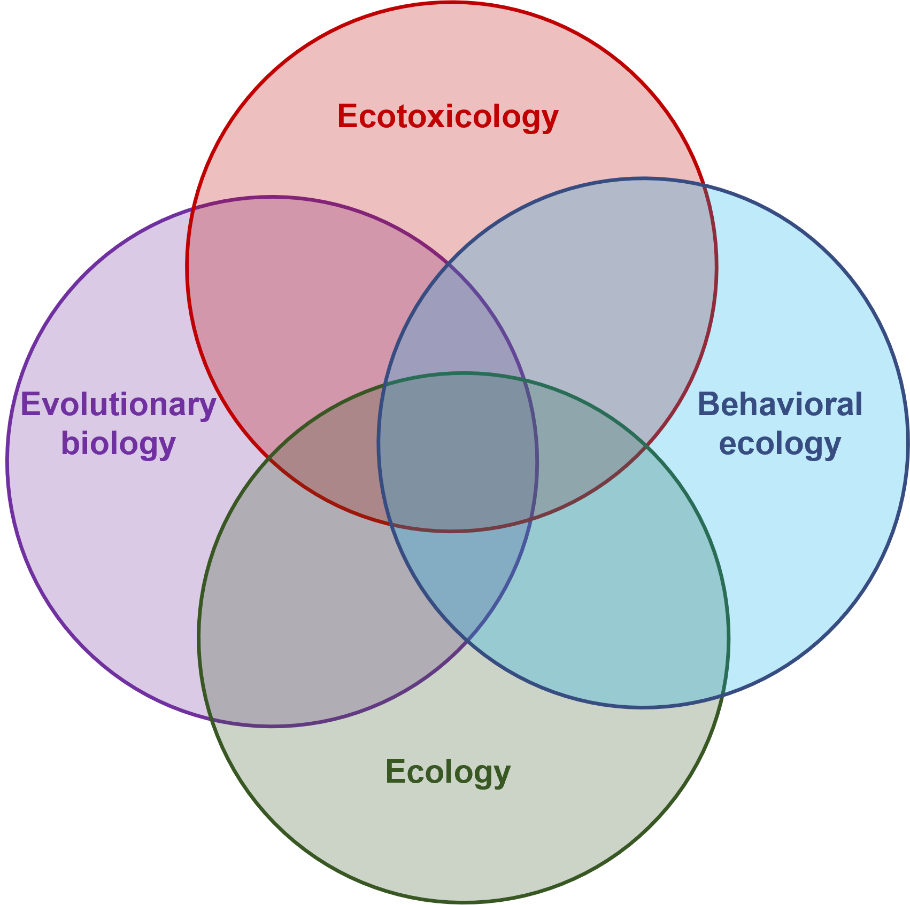

<!-- TOC JAVASCRIPT ELEMENTS - code from the "A poor man’s TOC in {distill}" page -->
<!-- https://distillery.rbind.io/posts/2022-01-24-the-toc-in-distill/?panelset1=css-elements2&panelset2=javascript-elements2&panelset=yaml-output -->

<script>
function toggle () {
  document.getElementById("TOC").classList.toggle("hide");
};

window.addEventListener('DOMContentLoaded', () => {

  const observer = new IntersectionObserver(entries => {
    entries.forEach(entry => {
      const id = entry.target.getAttribute('id');
      if (entry.intersectionRatio > 0) {
        document.querySelector(`[href="#${id}"]`).parentElement.classList.add('active');
      } else {
        document.querySelector(`[href="#${id}"]`).parentElement.classList.remove('active');
      }
    });
  });

  // Track all headings that have an `id` applied
  document.querySelectorAll('h1[id], h2[id], h3[id], h4[id], h5[id], h6[id]').forEach((h1, h2, h3, h4, h5, h6) => {
    observer.observe(h1, h2, h3, h4, h5, h6);
  });
  
});
</script>

<!-- TOC JAVASCRIPT ELEMENTS END -->

<p style="color: var(--title-color); font-family: var(--font-body); text-align: center; text-decoration-line: underline; font-size: 125%"> <b>Currently looking for opportunities<b></p>
<br/>
<p style='font-family: var(--font-header); font-weight: 700; color: var(--header-color); font-style: bold; font-size:175%;'>Quentin PETITJEAN, Ph.D&nbsp;<a href="mailto:q.petitjean1@gmail.com"><i class="fa fa-envelope fa-1.5x" aria-hidden="true"></i></a></p>
<div style="height: 0.125rem;"><br></div>
<p class="plain-text">
`r fontawesome::fa("flag", fill = "#333333")` &ensp; Nationalities<br/>
 &ensp; </p> 

<p class="plain-text">
`r fontawesome::fa("location-dot", fill = "#333333")` &ensp; Present/last institutional address<br/>
<a href="https://maps.google.com/maps?z=16&q=institut%2Bsophia%2Bagrobiotech%2Binrae-cnrs-universit%C3%A9%2Bc%C3%B4te%2Bd%27azur%2B400%2Broute%2Bdes%2Bchappes%2Bbp%2B167%2B06903%2Bsophia%2Bantipolis%2Bcedex%2Bfrance"> <small>Institut Sophia Agrobiotech, UMR5254 ISA, INRAE, CNRS, Universit&eacute; Côte d'Azur, Sophia-Antipolis, France.</small></a></p> 

***

# Keywords

<table style="border: none;">
  <tr>
    <td width='50%'>
`r fontawesome::fa("unlock-keyhole", fill = "#333333")` &ensp; Evolutionary-ecotoxicology <br/>
`r fontawesome::fa("unlock-keyhole", fill = "#333333")` &ensp; Eco-physiology <br/>
`r fontawesome::fa("unlock-keyhole", fill = "#333333")` &ensp; Ecology
</td>
    <td width='50%'>
`r fontawesome::fa("unlock-keyhole", fill = "#333333")` &ensp; Multiple stressors <br/>
`r fontawesome::fa("unlock-keyhole", fill = "#333333")` &ensp; Behavior <br/>
`r fontawesome::fa("unlock-keyhole", fill = "#333333")` &ensp; Intraspecific variability
</td>
  </tr>
</table>

***

# Education 
<p class="plain-text" style="text-align: left">
`r fontawesome::fa("graduation-cap", fill = "#333333")` &ensp; 2019 | <a href='https://www.univ-tlse3.fr/'>Paul Sabatier University—UPS</a> | Ph.D in environmental sciences/functional ecology <br/>
`r fontawesome::fa("graduation-cap", fill = "#333333")` &ensp; 2016 | <a href='https://www.ubfc.fr/'>Bourgogne-Franche-Comt&eacute; University—UBFC</a> | M.Sc. in environmental sciences/ecotoxicology  <br/>
`r fontawesome::fa("graduation-cap", fill = "#333333")` &ensp; 2014 | <a href='https://www.ubfc.fr/'>Bourgogne-Franche-Comt&eacute; University—UBFC</a> | B.Sc. in biology & ecology
</p> 
***

# Research experience
<p class="plain-text">
`r fontawesome::fa("briefcase", fill = "#333333")` &ensp; Mars 2021 - October 2022 | Postdoctoral researcher | <a href='https://www6.paca.inrae.fr/institut-sophia-agrobiotech'>National Research Institute for Agriculture, Food and Environment—INRAE</a>, Sophia-Antipolis, FR </p>
<details>
  <summary class= "summary">
  Details
  </summary>
<table style="border: none; width='100%';">
  <tr>
    <td style="width: 80%; vertical-align: top;">
<p class="detailed-text">
<em><u>Title:</u> «Study of intraspecific variability and thermal adaptation traits in parasitic micro-wasps using computer-vision approaches».<br/>
<u>Supervisor(s):</u>: Dr. Vincent CALCAGNO.</em><br/><br/>
Following my previous postdoctoral experience performing lab (DNA extractions – PCR) and bioinformatics analyses, my growing interest in the intraspecific variability of responses to global changes guided me to join <a href='https://www6.paca.inrae.fr/institut-sophia-agrobiotech'>Institut Sophia Agrobiotech (ISA)</a>.<br/><br/>
More particularly, I joined <a href='https://vcalcagnoresearch.wordpress.com/'>Vincent CALCAGNO</a>'s lab to investigate the variability in activity and movement among insect populations facing temperature changes. I was involved in the <a href='https://ecophytopic.fr/recherche-innovation/proteger/projet-bidime'>BIDIME project (ANR)</a> targeted at developing innovative biological control solutions with insects, and transfer them to farmers and land managers. I collaborated with <a href='https://fr.linkedin.com/in/michela-ion-scotta'>Michela ION SCOTTA</a>, who reared 35 populations of small parasitic micro-wasps (genus <em>Trichogramma</em>) that were sampled in France along a latitudinal gradient. Michela also performed experiments in which each population was subjected to steady decreases/increases in temperature (over 2 hours, see fig. \@ref(fig:Ramps)).</p>
```{r Ramps, echo=FALSE, message=FALSE, warning=FALSE, fig.align = 'center', out.width="90%", fig.cap="Temperature ramps over which micro-wasps movements were recorded and analyzed."}
# create the dataset
time = seq(
  from = as.POSIXct("2021-01-01 00:00"),
  to = as.POSIXct("2021-01-01 02:00"),
  by = "min"
)
temp = seq(from = 18 ,
           to = 45,
           by = (45 - 18) / floor(length(time) / 2))
tempW <- c(temp, rev(temp))
tempC <- c(rev(temp), temp)

# plot the warm and cold Ramps
par(
  mfrow = c(1, 2),
  oma = c(1, 1, 0, 0.8),
  mar = c(5, 3, 2, 0),
  mgp = c(2.2, 1, 0),
  bg="transparent"
)

plot(
  tempW[-1] ~ time,
  type = "l",
  lwd = 2.0,
  col = "#C70039",
  main = "Warm ramp",
  col.main = "#C70039",
  xlab = "Timeline hh:mm",
  ylab = "Measured Temperature (°C)"
)

plot(
  tempC[-1] ~ time,
  type = "l",
  lwd = 2.0,
  col = "#74C1D9",
  main = "Cold ramp",
  col.main = "#74C1D9",
  xlab = "Timeline hh:mm",
  ylab = "",
  yaxt = "n"
)
```
<p class="detailed-text">
The experiments were video-recorded, and my task was to use video-tracking solutions to quantify insect movements and their changes in response to temperature ramps.<br/>
I analyzed the movements of the 35 wasp populations to test for variability in thermal biology and activity patterns. My aim was to uncover patterns of local adaptation (i.e., relationship between thermal resistance and the bioclimatic area of the origin of the populations) and test for adaptive trade-offs between resistance to cold and warm temperatures.<br/><br/>
This work also inspired the development of an `r fontawesome::fa("r-project", fill = "steelblue")` package (MoveR) to easily process, filter, clean and analyze movement data obtained from video-tracking.<br/><br/>
Stay tuned for upcoming release.
</p>
</td>
    <td style="width: 20%; vertical-align: top;">
<a href='https://ecophytopic.fr/recherche-innovation/proteger/projet-bidime'></a></br>

<a href='https://www.inrae.fr/'></a></br>

<a href='https://anr.fr/'></a></br>

<a href='https://ecophytopic.fr/'></a></br>

<a href='https://www6.paca.inrae.fr/institut-sophia-agrobiotech'></a></br>

<a href='https://gredeg.univ-cotedazur.fr/'></a></br>

<a href='https://www6.montpellier.inrae.fr/cbgp/'></a></br>

<a href='https://www.astredhor.fr/'></a></br>

<a href='https://paca.chambres-agriculture.fr/'></a></br>

<a href='https://www.biolineagrosciences.com/fr/'></a></br>
</td>
  </tr>
</table>

<p class="detailed-text" style="text-align: center">
`r fontawesome::fa("circle-down", fill = "#333333")` For more insight about what I did within the project check the video below `r fontawesome::fa("circle-down", fill = "#333333")` 
</p>

<div class="video-container">
<iframe width="100%" height="100%" src="https://www.youtube.com/embed/Y9ltf08Iqb4" title="Video-phenotyping of thermal performances in minute wasps" frameborder="0" allow="accelerometer; autoplay; clipboard-write; encrypted-media; gyroscope; picture-in-picture" allowfullscreen></iframe>
</div>

</details>
<p class="plain-text">
`r fontawesome::fa("briefcase", fill = "#333333")` &ensp; January 2020 - December 2021 | Postdoctoral researcher | <a href='https://www.inp-toulouse.fr/fr/index.html'>National Polytechnic Institute—INP</a>, Toulouse, FR </p>
<details>
  <summary class= "summary">
  Details
  </summary>

<table style="border: none; width='100%';">
  <tr>
    <td style="width: 80%; vertical-align: top;">
<p class="detailed-text">
<em><u>Title:</u> «Gut microbiota shifts among freshwater fish populations exposed to multiple stressors under lab and field conditions».<br/>
<u>Supervisor(s):</u> Dr. Lisa JACQUIN, Dr. Jo&euml;l WHITE & Pr. Pascal LAFFAILLE.</em><br/><br/>
Following my Ph.D. defense, I was still Intending to increase the integration of multiple biological levels of organization in studying responses to multiple stressors. <br/><br/>
Since the literature highlighting the close relationships between physiological and behavioral responses and gut microbiota composition was flourishing, my supervisors (<a href='https://sites.google.com/site/jacquinlisa2'>Lisa JACQUIN</a>, <a href='https://scholar.google.com/citations?hl=fr&user=eI53HscAAAAJ&view_op=list_works&sortby=pubdate'>S&eacute;verine JEAN</a> and <a href='https://scholar.google.fr/citations?hl=fr&user=qMa0F0gAAAAJ&view_op=list_works&sortby=pubdate'>Pascal LAFFAILLE</a>) and I started a collaboration with <a href='https://whitejoel.weebly.com/'>Jo&euml;l WHITE</a> to investigate how multiples stressors may affect gut microbiota composition among several populations of wild fish. <br/><br/>
Fortunately, during my Ph.D., we collected the gut of all the fish involved in laboratory and reciprocal transplant experiments testing for the combined effect of trace metal contamination and immune challenge. This provided a fair amount of samples to investigate the intraspecific variability of gut microbiota composition in wild fish populations exposed to environmentally relevant stressors. Also, it allowed uncovering potential links between fish physiological and/or behavioral responses already measured during my Ph.D. and gut microbiota composition. <br/><br/>
While the COVID-19 pandemic knocked at the world's door, we were coerced to delay laboratory analyses (DNA extractions – PCR – NGS). Fortunately, I just had enough time to finish lab' and bioinformatic analyses before leaving this position for the next one. 
Currently, thanks to Margarita Granada (a Second-year master's student), final statistical analyses and writing are on the way! <br/><br/>
Stay tuned for further news to come.</p>

</p>
</td>
    <td style="width: 20%; vertical-align: top;">
      <a href='https://www.eco.omp.eu/'></a></br>
    
    <a href='https://edb.cnrs.fr/'></a></br>
    
    <a href='https://fr.wikipedia.org/wiki/%C3%89cole_nationale_sup%C3%A9rieure_agronomique_de_Toulouse'></a></br>
    
    <a href='https://www.univ-toulouse.fr/'></a></br>
    
    <a href='https://www.cnrs.fr/'></a></br>
    
    <a href='https://www.genotoul.fr/'></a></br>
</td>
  </tr>
</table>

</details>
<p class="plain-text">
`r fontawesome::fa("briefcase", fill = "#333333")` &ensp; October 2016 - December 2019 | Ph.D candidate | <a href='https://www.univ-tlse3.fr/'>Paul Sabatier University—UPS</a>, Toulouse, FR </p>
<details>
  <summary class= "summary">
  Details
  </summary>
<table style="border: none; width='100%';">
  <tr>
    <td style="width: 80%; vertical-align: top;">
<p class="detailed-text"> 
<em><u>Title:</u> «Variability of responses among freshwater fish populations exposed to multiple stressors».<br/>
<u>Supervisor(s):</u> Dr. Lisa JACQUIN, Dr. S&eacute;verine JEAN & Pr. Pascal LAFFAILLE.</em><br/><br/>
Freshly Graduated from Bourgogne-Franche-Comt&eacute; University with a master's in environmental sciences/ecotoxicology, I was lucky enough to work with very supportive people on stimulating and interdisciplinary projects (see my previous experiences below). Briefly, I was working on transfer, fate, and effects of contaminants on laboratory-raised organisms when new exciting questions arose. For example, could the outcomes of contaminants exposure differ according to the origin of the populations? Focusing on this question would imply working with wild populations. Still, in the wild, organisms are not only exposed to contaminants but rather to a combination of stressful conditions such as temperature changes or pathogens. This brings me to drill into evolutionary ecology and intraspecific variability to better understand how multiple stressors interact and whether the outcome of stressors exposure may differ among populations.<br/><br/>
Accordingly, I started a Ph.D. program with <a href='https://sites.google.com/site/jacquinlisa2'>Lisa JACQUIN</a>, <a href='https://scholar.google.com/citations?hl=fr&user=eI53HscAAAAJ&view_op=list_works&sortby=pubdate'>S&eacute;verine JEAN</a> and <a href='https://scholar.google.fr/citations?hl=fr&user=qMa0F0gAAAAJ&view_op=list_works&sortby=pubdate'>Pascal LAFFAILLE</a> to investigate the intraspecific variability of responses to multiple stressors among wild fish populations (<em>Gobio occitaniae</em>) and across levels of biological organization.<br/><br/>
To tackle these aims, I used complementary approaches (see fig. \@ref(fig:PhDApproaches) below) such as the analysis of large datasets collated in the field to uncover potential relationships between stressors exposure and fish health <a href='https://qpetitjean.github.io/qpetitjean_distill/publications.html#section-1'>(Petitjean et al., 2020)</a>. But also, full factorial design conducted in the lab to identify causal link between stressors exposure and plastic responses of fish from several populuations <a href='https://qpetitjean.github.io/qpetitjean_distill/publications.html#section-1'>(Petitjean et al., 2020;</a> <a href='https://qpetitjean.github.io/qpetitjean_distill/publications.html#section'> Petitjean et al., 2021)</a>. Finally, I performed a reciprocal transplant experiment in the field to unveil potential pattern of local adaptation to stressors exposure (Petitjean et al., under review).<br/>
```{r PhDApproaches, echo=FALSE, results='asis', message=FALSE, warning=FALSE, fig.align = 'center', out.width="90%", fig.cap="Summary of the research questions investigated during my Ph.D. and the complementary approaches used to tackle them."}
knitr::include_graphics('images/PhDApproaches.png')
```
Briefly, we found that combinations of stressors resulted in different outcomes than exposure to single stressors. Still, interactions were antagonistic, synergistic, or additive depending on the traits and level of biological organization. Accordingly, among the numerous traits measured, behavior appeared to be the most sensitive to stressors exposure. Also, populations' responses to stressors differed according to their origin. By using reciprocal transplant approaches, we found that some populations were more resistant to stream contamination with no apparent costs (no trade-off). the results of my Ph.D suggest that we need to rely on integrative and interdisciplinary approaches to improve our knowledge of the effect of multiple stressors and, more generally, global changes on populations' adaptive potential and vulnerability (see fig. \@ref(fig:PhDVensDiag)).
```{r PhDVensDiag, echo=FALSE, results='asis', message=FALSE, warning=FALSE, fig.align = 'center', out.width="90%", fig.cap="Summary of the research questions investigated during during my Ph.D. and the complementary approaches used to tackle them."}

```

For more information, see the <a href='https://qpetitjean.github.io/qpetitjean_distill/publications.html#section-2'>Publication section</a> of this website.</p>
</td>
    <td style="width: 20%; vertical-align: top;">
    <a href='https://www.eco.omp.eu/'></a></br>
    
    <a href='https://edb.cnrs.fr/'></a></br>
    
    <a href='https://fr.wikipedia.org/wiki/%C3%89cole_nationale_sup%C3%A9rieure_agronomique_de_Toulouse'></a></br>
    
    <a href='https://www.univ-toulouse.fr/'></a></br>
    
    <a href='https://www.cnrs.fr/'></a></br>
</td>
  </tr>
</table>

</details> 
<p class="plain-text">
`r fontawesome::fa("briefcase", fill = "#333333")` &ensp; February 2016 - July 2016 | M.Sc. candidate | <a href='https://www.ubfc.fr/'>Bourgogne-Franche-Comt&eacute; University—UBFC</a>, Besan&ccedil;on, FR </p>
<details>
  <summary class= "summary">
  Details
  </summary>
<table style="border: none; width='100%';">
  <tr>
    <td style="width: 80%; vertical-align: top;">
<p class="detailed-text">
<em><u>Title:</u> «Impacts of metallurgical wastes on soil contamination: transfer and fate of trace metal elements».<br/>
<u>Supervisor(s):</u> Dr. Annette DE VAUFLEURY & Dr. Fr&eacute;d&eacute;ric GIMBERT.</em><br/><br/>
During my second year of my master's, I was still motivated to strengthen our knowledge about the effects of contaminants from different sources on animals. Also, although short, my previous research experience aroused my curiosity and the need to broaden my scope by interacting with researchers embracing various disciplines. At that time, <a href='https://chrono-environnement.univ-fcomte.fr/spip.php?page=perso&nom=GIMBERT&prenom=Fr%C3%A9d%C3%A9ric'> Fr&eacute;d&eacute;ric GIMBERT</a> and <a href='https://chrono-environnement.univ-fcomte.fr/spip.php?page=perso&nom=DE%20VAUFLEURY&prenom=Annette'> Annette DE VAUFLEURY</a> gave me the opportunity to work on an interdisciplinary study involving archeology, mineralogy, environmental chemistry, and ecotoxicology. <br/><br/>
Indeed mining and metallurgical activities are the most ancient sources of anthropogenic contamination in the environment. While the evidence of this ancient contamination is scarce, archeological surveys in eastern France unveiled several areas (i.e., districts) which have been significant places of mining and metallurgical activities in the medieval era (between the 8th and the 12th centuries). Currently, metallurgical wastes named slags are still present in numerous district soils and may represent a significant source of soil contamination. <br/><br/>
Here we aimed to characterize the mineralogical composition of slags deposited one thousand years ago and to uncover whether it could still be a significant source of soil contamination that could transfer to organisms and have harmful effects. <br/><br/>
To tackle these aims, we sampled slags and soil cores along transects starting from the center of the slag heap. We then used scanning electron microscopy with energy dispersive spectrometry (EDS) mapping and x-ray diffraction to analyze slags and soil mineralogical composition. We also conducted chemical extraction and ecotoxicity bioassays using land snail (<em>Cantareus aspersus</em>) on soil samples to assess contaminant transfers in plants and biota and infer possible harmful effects. <br/><br/>
Briefly, We found that slags that remain in the soil still release a significant amount of manganese (Mn), which is consistent with their mineralogical composition. We also uncovered that a large proportion of the Mn contamination might be available for transfers in plants and animals, especially land snails. However, we did not find any evidence of toxicity caused by soils contamination on snails (see fig. \@ref(fig:GraphAbsChemos)). <br/>
```{r GraphAbsChemos, echo=FALSE, results='asis', message=FALSE, warning=FALSE, fig.align = 'center', out.width="90%", fig.cap="Summary of the results discussed in <a href='https://qpetitjean.github.io/qpetitjean_distill/publications.html#section'>Petitjean et al., 2021 Origin, fate and ecotoxicity of manganese from legacy metallurgical wastes</a>."}
GraphAbsChemos <- "https://ars.els-cdn.com/content/image/1-s2.0-S0045653521008079-ga1_lrg.jpg"
knitr::include_graphics(GraphAbsChemos)
```
This study and <a href='https://www.theses.fr/en/2016BESA2077'>previous work by Anne-Lise Mariet (former Ph.D. student) in the Vosges Mountains</a> paved the way to further projects/studies investigating the spatial occurrence, transfers, fate, and effects of metallic palaeo-pollution in eastern France (e.g., <a href='https://chrono-environnement.univ-fcomte.fr/spip.php?page=projet&projet=23'>SIDEROS</a> and <a href='https://chrono-environnement.univ-fcomte.fr/spip.php?page=projet&projet=53'>ALTERICS</a>).<br/><br/>
For more information, see the <a href='https://qpetitjean.github.io/qpetitjean_distill/publications.html#section'>Publication section</a> of this website.
</p>
</td>
    <td style="width: 20%; vertical-align: top;">
    <a href='https://chrono-environnement.univ-fcomte.fr/'></a></br>
    
    <a href='https://www.univ-fcomte.fr/'></a></br>
    
    <a href='https://www.ubfc.fr/'></a></br>
    
    <a href='https://www.cnrs.fr/'></a></br>
    
    <a href='https://www.culture.gouv.fr/en/Regions/Drac-Bourgogne-Franche-Comte'></a></br>
    
    <a href='https://chrono-environnement.univ-fcomte.fr/plateforme/PEA2t/?lang=en'></a></br>
    
    <a href='https://www.femto-st.fr/fr'></a></br>
</td>
  </tr>
</table>

</details>
<p class="plain-text">
`r fontawesome::fa("briefcase", fill = "#333333")` &ensp; February 2015 - May 2015 |  M.Sc. candidate | <a href='https://www.ubfc.fr/'>Bourgogne-Franche-Comt&eacute; University—UBFC</a>, Besan&ccedil;on, FR </p>
<details>
  <summary class= "summary">
  Details
  </summary>
<table style="border: none; width='100%';">
  <tr>
    <td style="width: 80%; vertical-align: top;">
<p class="detailed-text">
<em><u>Title:</u> «Trace metal availability and transfers assessment in a leachates pond collector from a municipal solid waste landfill using Chironomus riparius».<br/>
<u>Supervisor(s):</u> Dr. Fr&eacute;d&eacute;ric GIMBERT & Pr. Aleya LOTFI.</em><br/><br/>
While aware of the need to mitigate the increasing degradation of the environment caused by anthropogenic activities, I was motivated to strengthen our knowledge about the effects of contaminants on animals. In this context, I had the opportunity to conduct an internship with <a href='https://chrono-environnement.univ-fcomte.fr/spip.php?page=perso&nom=GIMBERT&prenom=Fr%C3%A9d%C3%A9ric'> Fr&eacute;d&eacute;ric GIMBERT</a> and <a href='https://chrono-environnement.univ-fcomte.fr/spip.php?page=perso&nom=ALEYA&prenom=Lotfi'>Lotfi ALEYA</a> to investigate the bioavailability of trace metal elements in a landfill leachate collection pond.<br/><br/>
Indeed, until 2002 household waste disposal was authorized in France, resulting in contamination of the surrounding environment, primarily through contaminants leaching. To reduce environmental contamination entailed by this mode of waste storage, the Etueffont landfill (i.e., study site) set up a lagoon ponds system collecting landfill leachates.<br/><br/>
Here, we aimed to better understand whether leachates released in the ponds may induce the accumulation of trace metal elements in biota (i.e., bioaccumulation kinetics) and how water and sediment may contribute to the observed bioaccumulation' patterns.<br/><br/>
To tackle these aims, we used an active biomonitoring approach through caging laboratory-raised midges larvae (<em>Chironomus riparius</em>) in the first landfill leachate collection pond. More particularly, we used two types of cages to either expose the larvae to water only or water and sediment for a five days maximum duration (see fig. \@ref(fig:CagesTypes)).<br/>
```{r CagesTypes, echo=FALSE, results='asis', message=FALSE, warning=FALSE, fig.align = 'center', out.width="80%", fig.cap="Type of cages used for active biomonitoring, the cage on the left (WS) allows exposing the midges to water and sediment. In contrast, the cage on the right (W) allows exposing the midges to water only."}
cagesURL <- "https://media.springernature.com/full/springer-static/image/art%3A10.1007%2Fs11356-016-8261-1/MediaObjects/11356_2016_8261_Fig2_HTML.gif"
knitr::include_graphics(cagesURL)
```
Back in the laboratory, we performed subcellular fractionation of the midges to measure trace metal bioaccumulation in the cytosolic (i.e., sensitive fraction) and insoluble fractions. We then modeled the bioaccumulation kinetic for each contaminant and fraction. This helped to discuss the primary source of contaminant transfers (i.e., water and/or sediment), contaminant bioavailability, and the potential threat entailed by landfill leachates on biota.<br/><br/>
For more information, see the <a href='https://qpetitjean.github.io/qpetitjean_distill/publications.html#section-3'>Publication section</a> of this website.</p>
</p>
</td>
    <td style="width: 20%; vertical-align: top;">
    <a href='https://chrono-environnement.univ-fcomte.fr/'></a></br>
    
    <a href='https://www.univ-fcomte.fr/'></a></br>
    
    <a href='https://www.ubfc.fr/'></a></br>
    
    <a href='https://www.cnrs.fr/'></a></br>
</td>
  </tr>
</table>
    
</details>
***

# Teaching & supervising
<p class="plain-text" style="text-align: left">
`r fontawesome::fa("chalkboard-user", fill = "#333333")` &ensp; <a href='https://www.inp-toulouse.fr/fr/index.html'>National Polytechnic Institute—INP</a> | Electrofishing/inventory of fish species&nbsp;(≈16h) <br/>
`r fontawesome::fa("chalkboard-user", fill = "#333333")` &ensp; <a href='https://www.univ-tlse3.fr/'>Paul Sabatier University—UPS</a> | Multivariate data analysis&nbsp;(≈50h) <br/>
`r fontawesome::fa("chalkboard-user", fill = "#333333")` &ensp; Students internship co-supervision | 8 B.Sc and 5 M.Sc students
</p>
***

# Grants
<p class="plain-text" style="text-align: left">
`r fontawesome::fa("trophy", fill = "#333333")` &ensp; 2019 | Travel grant for the SETAC Europe 29<sup>th</sup> meeting&nbsp;(≈430€) </p>
<details>
  <summary class= "summary">
  Details
  </summary>
  
  <p style="text-align:center;">
  </p>
  <p class="detailed-text">
  Grant programme supported by the SETAC Europe reinvestment fund and Syngenta to help student members participating to the <a href='https://helsinki.setac.org/welcome/'>SETAC Europe 29<sup>th</sup> meeting</a> meeting (Up to maximum 250€, Travel costs only, visa and accommodation are not included).
</p>
</details>
<p class="plain-text">
`r fontawesome::fa("trophy", fill = "#333333")` &ensp; 2016 | Ph.D grant from French research and education ministry&nbsp;(≈60k€) </p>
<details>
  <summary class= "summary">
  Details
  </summary>
  
  <p style="text-align:center;">
   &ensp; 
   &ensp; 
  </p>
<p class="detailed-text">
3 years stipend allowed by the French research and education ministry to study the variability of responses among freshwater fish populations (<em>Gobio occitaniae</em>) exposed to multiple stressors at the <a href='https://www.univ-tlse3.fr/'>Paul Sabatier University—UPS</a>.
</p>
</details>
<p class="plain-text">
`r fontawesome::fa("trophy", fill = "#333333")` &ensp; 2015 | Leonard Da Vinci international mobility grant&nbsp;(≈2.5k€) </p>
<details>
  <summary class= "summary">
  Details
  </summary>
  
  <p style="text-align:center;">
   &ensp; 
  </p>
<p class="detailed-text">
European grant supporting individual mobility projects to acquire training and professional experience within Europe. <br/></p>
<p class="detailed-text">
I conducted a 3.5 month internship (June 2014 to mid-september 2014) in the Plant Ecology Research Unit (PERU) of the <a href='https://www.nuigalway.ie/'>National University of Ireland Galway (NUIG)</a> under the supervision of <a href='https://www.universityofgalway.ie/science-engineering/school-of-natural-sciences/disciplines/botany-plant-science/research/plant-and-algal-marine-ecology/michelinesheehyskeffington/'>Micheline Sheehy Skeffington</a>. Micheline is currently emeritus at NUIG and a long-standing fighter of gender discrimination (<a href='https://michelinesthreeconditions.wordpress.com/'>see here for more infos</a>).
I have mainly assisted Micheline and it's former team members (James Owens and Sarah O'loughlin-Irwin) to conduct plants inventories in heatland and hay meadows.
I have also worked to update the collection of the university of Galway' herbarium. <br/></p>
<p class="detailed-text">
<u>Internship subjects:</u> <br/>
«Restoring plant species richness and forage quality to hay meadows on the River Shannon, Ireland.»
<br/>
«Ecology and conservation of <em>Arctostaphylos</em> heath in the Burren, Western Ireland.»
</p>
</details>

***

# Congress & Professional memberships 
### Congress organization
<p class="plain-text">
`r fontawesome::fa("sitemap", fill = "#333333")` &ensp; 14th meeting Ecology and Behaviour (E&B) 2019</p>
<details>
  <summary class= "summary">
  Details
  </summary>
<p class="detailed-text">
The « Ecology and Behaviour » conferences are organized by and for young researchers. These events are an ideal opportunity for master, Ph.D. students, and postdocs to share their works with other researchers in ecology, evolutionary biology, and behavioral ecology. <br/></p>
<p class="detailed-text">
As Co-organizer, chairman (Ecotoxicology & Ecophysiology session), and financial manager (Fundraising: 20k€) of the <a href='https://eb2019.sciencesconf.org/'>14th meeting Ecology and Behaviour (E&B) 2019</a>, I am delighted to have participated in this outstanding achievement which gathered more than 160 attendees and 14 keynote speakers around 56 platform presentations and 38 posters. <br/></p>
<p style="text-align:center;">
  </p>
</details>

### Membership 
<p class="plain-text" style="text-align: left">
`r fontawesome::fa("handshake", fill = "#333333")` &ensp; British Ecological Society&nbsp;<a href='https://www.britishecologicalsociety.org/'>(BES)</a> <br/>
`r fontawesome::fa("handshake", fill = "#333333")` &ensp; Soci&eacute;t&eacute; Française d’&Eacute;cologie et d’&Eacute;volution&nbsp;<a href='https://sfecologie.org/'>(SFE²)</a> <br/>
`r fontawesome::fa("handshake", fill = "#333333")` &ensp; Society of Environmental Toxicology and Chemistry&nbsp;<a href='https://www.setac.org/'>(SETAC)</a> <br/>
`r fontawesome::fa("handshake", fill = "#333333")` &ensp; Society for open, reliable and transparent ecology and evolutionary biology&nbsp;<a href='https://www.sortee.org/'>(SORTEE)</a> <br/>
`r fontawesome::fa("handshake", fill = "#333333")` &ensp; Statistical ecology research network&nbsp;<a href='https://sites.google.com/site/gdrecostat/'>(EcoStat)</a></p>

***

# Peer reviews
<p class="plain-text" style="text-align: left">
`r fontawesome::fa("file-lines", fill = "#333333")` &ensp; <a href='https://www.springer.com/journal/11356'>Environmental Science and Pollution Research</a>&nbsp;(n=4)<br/>
`r fontawesome::fa("file-lines", fill = "#333333")` &ensp; <a href='https://www.tandfonline.com/journals/best20'>Critical Reviews in Environmental Sciences and Technology</a>&nbsp;(n=2)<br/>
`r fontawesome::fa("file-lines", fill = "#333333")` &ensp; <a href='https://onlinelibrary.wiley.com/journal/24715646'>Journal of Experimental Zoology Part A: Ecological Genetics and Physiology</a>&nbsp;(n=1)<br/>
`r fontawesome::fa("file-lines", fill = "#333333")` &ensp; <a href='https://www.sciencedirect.com/journal/science-of-the-total-environment'>Science of The Total Environment</a>&nbsp;(n=1)<br/>
`r fontawesome::fa("file-lines", fill = "#333333")` &ensp; <a href='https://onlinelibrary.wiley.com/journal/14610248'>Ecology Letters</a>&nbsp;(n=1)</p>

***

# Hobbies
<p class="plain-text">
`r fontawesome::fa("person-hiking", fill = "#333333")` &ensp; Hiking/fishing: Fauna and flora watching and photography <br/>
`r fontawesome::fa("person-hiking", fill = "#333333")` &ensp; Sports: Basket ball, volley-ball <br/>
`r fontawesome::fa("person-hiking", fill = "#333333")` &ensp; Travel: Cultural and naturalist trip (Western Europe, China, Sri Lanka, Malaysia, Nicaragua)</p>
